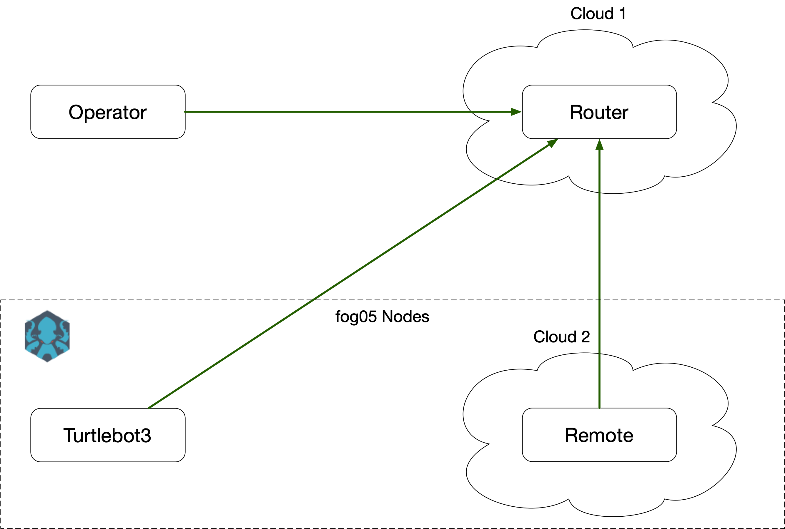

# Turtlebot3 Teleoperation Example


This example shows the deployment of a teleoperation application with fog05.
It uses Native Plugin and ROS2 Plugin.


## Required materials

- Turtlebot3 with Ubuntu 20.04 and ROS2 Foxy
- Three x86_64 Ubuntu 20.04 Linux machines
- An USB webcam
- An USB Controller (ideally and XBOX One/OneS/OneX  controller)


## Setup HW

Connect the USB camera to the Turtlebot3.
Arrange connectivity of the machines as illustrated in the following picture.





## Setup SW
Build and Install OpenCV on the turtlebot3 following this guide: https://docs.opencv.org/master/d7/d9f/tutorial_linux_install.html

Install ROS2 Foxy on the "remote" Ubuntu machine: https://docs.ros.org/en/foxy/Installation/Linux-Install-Debians.html

After installing ROS2 make sure that the CycloneDDS RMW is installed or install it with `sudo apt install ros-foxy-rmw-cyclonedds-cpp`

Install `colcon` on both the Turtlebot3 and the "remote" machine: `sudo apt install python3-colcon-common-extensions`


Install rust night on all machines: `curl --proto "=https" --tlsv1.2 -sSf https://sh.rustup.rs | sh -s -- --default-toolchain nightly -y`


Build the `tb3_ws` workspace on the Turtlebot3 and package it as tar.gz

```
$ scp -r ./tb3_ws ubuntu@turtlebot3:~
$ ssh ubuntu@turtlebot3
$ source /opt/ros/foxy/setup.bash
$ export RMW_IMPLEMENTATION=rmw_cyclonedds_cpp
$ cd tb3_ws
$ colcon build
$ cd ..
$ tar -czvf tb3_ws.tar.gz tb3_ws
```

Build the `teleop_ws` workspace on the "remote" and package it as tar.gz

```
$ scp -r ./teleop_ws ubuntu@remote:~
$ ssh ubuntu@remote
$ source /opt/ros/foxy/setup.bash
$ export RMW_IMPLEMENTATION=rmw_cyclonedds_cpp
$ cd teleop_ws
$ colcon build
$ cd ..
$ tar -czvf teleop_ws.tar.gz teleop_ws
```

Clone and build `Zenoh Plugin DDS` on both Turtlebot3 and "remote" following this guide: https://github.com/eclipse-zenoh/zenoh-plugin-dds#trying-it-out

Then copy the binary according to the descriptors path:

- On Turtlebot3 `cp ./target/release/dzd ~/dzd`
- On "remote" machine `cp ./target/release/dzd ~/fos/dzd`

Clone and build `zcam` on the Turtlebot3 and on "operator" machine:

```
$ git clone https://github.com/kydos/zcam
$ cd zcam
$ cargo build --release
```

Then clone and build the Joypad client on the "operator" machine:

```
$ sudo apt install libudev-dev
$ git clone https://github.com/atolab/zenoh-ros2-teleop
$ cd zenoh-ros2-teleop
$ cargo build --release --bin teleop
```


Then clone and build Zenoh on the "router" machine:

```
$ git clone https://github.com/eclipse-zenoh/zenoh
$ cd zenoh
$ cargo build --release --bin zenohd
```

## Setup Eclipse fog05

Install fog05 on both Turtlebot3 and "remote" machine.

First let's install some dependencies:
```
$ sudo apt install build-essential devscripts debhelper pkg-config dpkg-dev nftables libnftnl-dev libnfnetlink-dev libmnl-dev -y
$ cargo install cargo-deb
$ mkdir debs
```


Then let's clone and build Zenoh:

```
$ git clone https://github.com/eclipse-zenoh/zenoh
$ cd zenoh
$ cargo deb -p zenoh
$ cargo deb -p zenoh-storages
$ mv target/debian/* ~/debs/
```

Clone and build fog05 Agent and fosctl

```
$ git clone https://github.com/eclipse-fog05/fog05
$ cd fog05
$ cargo deb -p fog05-agent
$ cargo deb -p fog05-fosctl
$ mv target/debian/* ~/debs/
```

Clone and build fog05 Networking Plugin

```
$ git clone https://github.com/eclipse-fog05/fog05-networking-linux
$ cd fog05-networking-linux
$ cargo deb
$ mv target/debian/* ~/debs/
```

Clone and build fog05 Native Plugin

```
$ git clone https://github.com/eclipse-fog05/fog05-hypervisor-native
$ cd fog05-hypervisor-native
$ cargo deb
$ mv target/debian/* ~/debs/
```


Clone and build fog05 ROS2 Plugin

```
$ git clone https://github.com/eclipse-fog05/fog05-hypervisor-ros2
$ cd fog05-hypervisor-ros2
$ cargo deb
$ mv target/debian/* ~/debs/
```

Let's install all the packages, stop and disable fog05 services.

```
sudo apt install ~/debs/* -y

sudo systemctl disable fos-hv-ros2
sudo systemctl disable fos-hv-native
sudo systemctl disable fos-net-linux
sudo systemctl disable fos-agent
sudo systemctl disable fos-zenoh

sudo systemctl stop fos-hv-native
sudo systemctl stop fos-hv-ros2
sudo systemctl stop fos-net-linux
sudo systemctl stop fos-agent
sudo systemctl stop fos-zenoh
```

Update the configuration of fog05 according to your scenario:

### On turtlebot3

Update `/etc/fos/agent.yaml` with `mgmt_interface : wlan0` and `/etc/fos/linux-network/config.yaml` with both `overlay_iface` and `dataplane_iface` with `wlan0`.
Update `/lib/systemd/system/fos-zenoh.service` by adding at the end of line #12 `-e tcp/<ip of remote machine>:61189`

### On "remote" machine

Update `/etc/fos/agent.yaml` with `mgmt_interface` and `/etc/fos/linux-network/config.yaml` with both `overlay_iface` and `dataplane_iface` according to your default interface.

You can get your default interface with `/sbin/ip route | awk '/default/ { print $5 }'`


Once everything is configured you can start fog05 service, first on the remote machine and then on the Turtlebot3

```
sudo systemctl start fos-zenoh
sudo systemctl start fos-agent
sudo systemctl start fos-net-linux
sudo systemctl start fos-hv-ros2
sudo systemctl start fos-hv-native
```

Verify that the nodes are running using `fosctl fim get node`, the nodes may take a minute or two before being "Ready".


## Update the descriptor

You need to update your descriptor according to you network configuration.

In particular you need to replace `tcp/eu.zenoh.io:7447` with the locator of your router machine, `tcp/<ip router machine>:7447`.

You also need to verify that the Path for images and command corresponds to your configuration.


## Run the demo

First start `zenohd` on the "router" machine: `./target/release/zenohd` (if you want some logging set `RUST_LOG=debug` in your environment before starting `zenohd`)

Then onboard the descriptor in Eclipse fog05:
```
$ fosctl fim add entity entity-tb3-teleop.yaml
```

It will give you an UUID that is used to instantiate the application.

```
$ fosctl fim add instance <entity uuid given by the previous command>
```

You can monitor the status of the instance with `fosctl fim get instance`


Once it is reported as "RUNNING" it is possible to start both the Joypad client and the camera client on the "operator node"

- Camera client: `./zcam/target/release/zdisplay -m client -e tcp/<router ip>:7447 -p /robot/video`
- Joypad client `./zenoh-ros2-teleop/target/release/teleop tcp/<router ip>:7447`


You should see the camera feed from the robot and you should be able to move the robot using the left analog stick and the two triggers.


